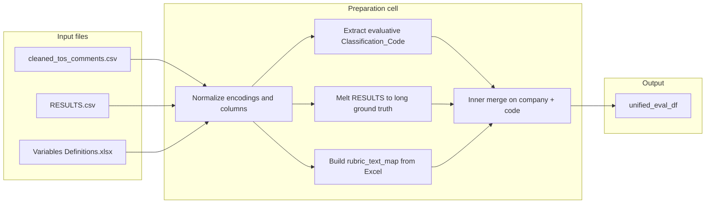

# Data Preparation for the 100 ToS LLM Evaluation Pipeline

Created on May 27, 2026

This document explains the **data preparation cell** in [`100_tos_evaluation.ipynb`](100_tos_evaluation.ipynb) in depth: what each step does, **why** it is designed that way, and how the resulting `unified_eval_df` supports a fair, reproducible comparison between LLM predictions and academic ground truth.

---

## 1. What this section is trying to accomplish

The Lawgic evaluation pipeline does **not** ask a model to read an entire Terms of Service (ToS) document and invent labels from scratch. Instead, it evaluates a narrower, well-defined task:

> Given a **specific clause excerpt**, a **legal variable category** (e.g. `serv_chg`, `ltd`), and the **official scoring rubric** for that category, predict the ordinal severity score **`-1`**, **`0`**, or **`1`**.

To score that prediction against human annotations, we must assemble three independent sources into one row-level table:

| Source | Role |
|--------|------|
| `cleaned_tos_comments.csv` | **What text** to show the model (`referenced_text`) and **which variable** the annotators linked it to (via `comment`) |
| `Terms of Service Analysis and Evaluation_RESULTS.csv` | **Ground-truth score** per company × variable (wide table from the thesis dataset) |
| `Variables Definitions.xlsx` (sheet *Evaluative Variables*) | **Rubric text** defining what `-1`, `0`, and `1` mean for each variable |

The preparation cell’s output is **`unified_eval_df`**: one row per evaluable clause instance, with everything the LangChain prompt needs plus the label for F1 computation.

Without this preprocessing, you would either:

- prompt the model without rubrics (non-reproducible, not comparable to the dataset’s methodology), or  
- compare predictions to the wrong ground-truth row (company/code mismatch), or  
- include clause types that are not ordinal `-1/0/1` tasks (count variables, free-text pulls).

---

## 2. End-to-end data flow (conceptual)



Each arrow corresponds to a deliberate design choice discussed below.

---

## 3. Resolving paths and repository root

```python
candidate_roots = [Path.cwd(), Path.cwd().parent, Path.cwd().parent.parent]
```

**What it does:** Walks upward from the Jupyter kernel’s current working directory until it finds a folder that contains all three required files (comments, results, rubric).

**Why:** Notebook kernels often start in `notebooks/100_tos/`, the repo root, or elsewhere depending on how you launch Jupyter. Hard-coding `../../` only works in one layout. Root detection makes the same cell runnable from Cursor, VS Code, or CLI without editing paths every time.

**Effect on evaluation:** Reproducibility. Anyone who clones the repo and runs the notebook gets the same file resolution logic, reducing “file not found” or silently reading the wrong copy of a CSV.

---

## 4. Loading the three inputs

### 4.1 Extracted clauses — `cleaned_tos_comments.csv`

```python
comments_df = pd.read_csv(comments_path, encoding="utf-8-sig")
comments_df.columns = [str(c).replace("\ufeff", "").strip() for c in comments_df.columns]
```

**Schema (conceptually):**

| Column | Meaning |
|--------|---------|
| `company` | Platform name (e.g. YouTube, Dropbox) |
| `comment_id` | Identifier for the annotation row |
| `author` | Annotator label |
| `comment` | **Variable tag** (and sometimes score hints), e.g. `serv_chg -1`, `uncle`, `docu 2` |
| `referenced_text` | **Clause excerpt** pulled from the ToS for that annotation |

**Encoding (`utf-8-sig`):** Some exports include a UTF-8 BOM. Without `-sig`, the first column name can become `\ufeffcompany`, breaking merges and lookups. Stripping `\ufeff` from column names is defensive cleanup.

**Why this file matters:** It is the bridge between “full ToS document” and **clause-level** evaluation. The pipeline never passes the whole document—only `referenced_text`—which matches Lawgic’s JIT warning use case (a specific passage triggers a specific risk category).

---

### 4.2 Ground truth — `RESULTS.csv`

```python
results_df = pd.read_csv(results_path, sep=";", encoding="utf-8-sig")
```

**Shape:** ~100 rows (one per platform) × ~47 columns.

**Structure:** A **wide** table:

- Identity/metadata: `ID`, `name`, `url`, `sector`, …
- One column per **legal variable code**: `ltd`, `serv_chg`, `acc_del`, …
- Cell values: ordinal scores (`-1`, `0`, `1`), `NA`, or occasionally non-ordinal values for non-evaluative columns

**Delimiter (`sep=";"`):** The academic export uses semicolons, not commas. Using the wrong separator would collapse the file into one column and destroy ground truth.

**Why wide → long later:** Annotators work on **clauses** (many rows per company in `cleaned_tos_comments.csv`), but the thesis results file stores **one score per company per variable**. Melting (see §7) aligns “YouTube + `serv_chg`” in comments with “YouTube + `serv_chg`” in results.

---

### 4.3 Rubrics — `Variables Definitions.xlsx`

```python
rubric_df = pd.read_excel(rubric_path, sheet_name="Evaluative Variables")
```

**Shape in Excel:** Grouped blocks. Each variable has multiple rows—one per score level—with merged-style empty cells in the first columns.

Example structure:

| Code | Score | Detailed description |
|------|-------|----------------------|
| `ltd` | -1 | Unlawful limitation of liability… |
| (blank) | 0 | Lawful limitation… |
| (blank) | 1 | Lack of limitation |

**Why only “Evaluative Variables”:** The thesis dataset distinguishes:

- **Evaluative variables** — ordinal consumer-protection scores in `{-1, 0, 1}` (liability caps, forum choice, etc.)
- **Count variables** — e.g. number of `uncle` clauses (`uncle`, `docu`)
- **Pull-out text** — `core`, `what` (descriptive excerpts, not a single ordinal per platform)
- **Metadata** — URL, word count, HQ country

The evaluation plan explicitly scopes to **ordinal classification**, not counting or metadata prediction. Pulling the wrong sheet would bake incorrect rubrics into prompts.

---

## 5. Cleaning the rubric table

```python
rubric_df["Code"] = rubric_df["Code"].ffill()
rubric_df["Variable name"] = rubric_df["Variable name"].ffill()
rubric_df = rubric_df.dropna(subset=["Code", "Score", "Detailed description"]).copy()
rubric_df["Code"] = rubric_df["Code"].astype(str).str.strip().str.lower()
rubric_df["Score"] = pd.to_numeric(rubric_df["Score"], errors="coerce")
rubric_df = rubric_df[rubric_df["Score"].isin([-1, 0, 1])].copy()
rubric_df["Score"] = rubric_df["Score"].astype(int)
```

### 5.1 Forward-fill (`ffill`)

Excel layout leaves `Code` empty on continuation rows. `ffill` propagates `ltd` down to its `0` and `1` rows so every rubric line is addressable by code.

**Decision rationale:** Mirrors how human readers interpret the spreadsheet; avoids losing score-level definitions.

### 5.2 Drop incomplete rows, coerce scores

Removes header fragments and rows without a numeric score. Restricting to `{-1, 0, 1}` matches the evaluation contract and excludes stray text rows.

**Why this helps the LLM:** The prompt injects `Specific_Rubric` as the **only** definition of severity. Rubric rows must be complete and consistently scored; otherwise the model optimizes for ambiguous or missing criteria.

### 5.3 `evaluative_codes` list

```python
evaluative_codes = sorted(rubric_df["Code"].unique(), key=len, reverse=True)
```

Sorted **longest code first** (e.g. `ltd_cap` before `ltd`) for regex matching (§6).

**Why:** Word-boundary regex alternation is greedy left-to-right. If `ltd` were listed before `ltd_cap`, a comment mentioning `ltd_cap` might incorrectly match `ltd` first. Length ordering is a standard trick for multi-token code dictionaries.

---

## 6. Extracting `Classification_Code` from annotator comments

```python
code_pattern = re.compile(
    r"\b(" + "|".join(re.escape(c) for c in evaluative_codes) + r")\b",
    flags=re.IGNORECASE,
)

def extract_classification_code(comment_text: str):
    ...
```

### 6.1 What `comment` actually contains

In `cleaned_tos_comments.csv`, `comment` is **not** free-form prose. It is a **variable label** assigned during annotation, often with optional score hints:

- `serv_chg -1`
- `acc_del 0`
- `ltd -1`
- `uncle` (count variable — no ordinal platform score)
- `what` (pull-out text)
- `docu 2` (count of incorporated documents)

The pipeline must recover the **variable code** so it can attach the correct rubric and ground-truth column.

### 6.2 Regex with word boundaries

`\b(code)\b` ensures `class` does not match inside unrelated tokens and that codes are detected as standalone tokens in strings like `acc_del -1`.

**Critical implementation detail:** The pattern must use `\b` (one backslash in a raw string), not `\\b` (which matches literal characters `\` + `b` and matches nothing). A broken pattern zeroes out the dataframe—a failure mode you already hit in development.

### 6.3 Filter to evaluative codes only

```python
comments_df = comments_df[comments_df["Classification_Code"].isin(set(evaluative_codes))].copy()
```

**Decision:** Drop rows whose comments refer to `uncle`, `docu`, `core`, `what`, etc.

**Why:**

| Variable type | Ground truth in RESULTS | Suitable for `-1/0/1` LLM task? |
|---------------|-------------------------|----------------------------------|
| Evaluative (`ltd`, `serv_chg`, …) | Single ordinal per platform | **Yes** |
| Count (`uncle`, `docu`) | Integer counts, not `-1/0/1` | **No** |
| Pull-out (`core`, `what`) | Text columns / excerpts | **No** |

Including count or pull-out rows would force the model into a task the rubric sheet does not define for ordinal scoring, and F1 against `RESULTS` would be meaningless.

**Trade-off:** You lose rows (~2640 → ~1565 after extraction in typical runs) but gain **task validity**.

---

## 7. Company normalization

```python
comments_df["Company"] = comments_df["company"].astype(str).str.strip()
comments_df["company_norm"] = comments_df["Company"].str.lower().str.strip()
```

**Why two columns:**

- `Company` — human-readable name for prompts and CSV export.
- `company_norm` — merge key resistant to case drift (`YouTube` vs `youtube`).

The results file uses `name` for the platform; normalization on both sides reduces failed merges when strings differ only by casing or stray whitespace.

**Limitation (important):** This does **not** fix alias names (`SQUARE ENIX` vs `Square Enix Co., Ltd.`). Unmatched names are dropped in the inner merge—by design, to avoid pairing a clause with another company’s ground truth, which would corrupt F1.

---

## 8. Building long-form ground truth

```python
available_eval_codes = [c for c in evaluative_codes if c in results_df.columns]
gt_long_df = results_df.melt(
    id_vars=["name"],
    value_vars=available_eval_codes,
    var_name="Classification_Code",
    value_name="Ground_Truth_Score",
)
```

### 8.1 Why melt?

**Before melt:** one row per company, scores spread across columns.  
**After melt:** one row per `(company, Classification_Code)` with `Ground_Truth_Score`.

That mirrors the clause table: many comment rows can share the same `(company, code)` but each carries a different `referenced_text` excerpt for the **same** platform-level score.

### 8.2 Filtering valid ordinals

```python
gt_long_df["Ground_Truth_Score"] = pd.to_numeric(gt_long_df["Ground_Truth_Score"], errors="coerce")
gt_long_df = gt_long_df[gt_long_df["Ground_Truth_Score"].isin([-1, 0, 1])].copy()
```

**Why:** Some cells are `NA` or non-numeric. Coercing and filtering ensures every training/evaluation label is a valid class for macro-F1.

**Evaluation implication:** The model is judged against the **same three-way scale** the thesis coders used for evaluative variables, not against missing data.

---

## 9. Building `Specific_Rubric` per code

```python
rubric_text_map = (
    rubric_df.sort_values(["Code", "Score"])
    .groupby("Code")
    .apply(
        lambda g: "\n".join([f"{int(row['Score'])}: {str(row['Detailed description']).strip()}" for _, row in g.iterrows()]),
        include_groups=False,
    )
    .to_dict()
)
```

**Output example (conceptual):**

```text
-1: Unlawful limitation of liability for damages...
0: Lawful limitation - any other than unlawful...
1: Lack of limitation
```

**Design decisions:**

1. **Programmatic extraction from Excel** — satisfies the constraint “do not hallucinate rubrics.” The LLM sees the same definitions coders had.
2. **Concatenate all three levels** — the model must discriminate among `-1`, `0`, and `1` in one shot; providing only the target level would leak the answer in supervised setups and would not reflect deployment (where the true score is unknown).
3. **`include_groups=False`** — silences pandas `FutureWarning` on `groupby().apply()`; behavior unchanged.

```python
merged_df["Specific_Rubric"] = merged_df["Classification_Code"].map(rubric_text_map)
```

Maps rubric text by code, not by company—rubrics are **variable-specific**, not platform-specific, which matches the thesis coding scheme.

---

## 10. The inner merge — aligning clauses with labels

```python
merged_df = comments_df.merge(
    gt_long_df[["company_norm", "Classification_Code", "Ground_Truth_Score"]],
    on=["company_norm", "Classification_Code"],
    how="inner",
)
```

**Join keys:** normalized company name + classification code.

**Why `inner` join:**

- **Left join** would keep clauses with no ground truth → `NaN` labels → broken F1 and wasted API calls.
- **Outer join** would invent rows with no clause text.

Inner join keeps only **(company, variable)** pairs that exist in **both** the clause export and the results table.

**What you get:** Each clause row inherits the **platform-level** ground-truth score for that variable. Multiple clause excerpts from the same company and same variable (e.g. three different `serv_chg` passages) will share the same `Ground_Truth_Score`. That is correct for this dataset: RESULTS does not score each excerpt separately; it scores the ToS holistically per variable.

**Research caveat:** If two excerpts for the same `(company, code)` implied different severities, this pipeline would still assign one label—an inherited limitation of RESULTS, not a bug in the merge code.

---

## 11. Assembling `unified_eval_df`

```python
unified_eval_df = (
    merged_df[["Company", "Classification_Code", "referenced_text", "Specific_Rubric", "Ground_Truth_Score"]]
    .rename(columns={"referenced_text": "Referenced_Text"})
    .dropna(subset=["Referenced_Text", "Specific_Rubric", "Ground_Truth_Score"])
    .reset_index(drop=True)
)
```

### Final columns and their role in the LLM pipeline

| Column | Used in prompt? | Used in metrics? |
|--------|-----------------|------------------|
| `Company` | Yes — context (which platform) | No |
| `Classification_Code` | Yes — which legal variable | No |
| `Referenced_Text` | Yes — **only** clause body shown | No |
| `Specific_Rubric` | Yes — scoring criteria | No |
| `Ground_Truth_Score` | **No** (must not leak label) | Yes — F1 target |

**`dropna`:** Guarantees every evaluation row is complete. Rows missing rubric (unknown code) or text are removed rather than failing mid-loop.

**Typical scale after a successful run:**

- ~2640 raw comments  
- ~1565 after evaluative code extraction  
- ~1400+ after inner merge and dropna (exact count depends on company name overlap)

---

## 12. Sanity-print statements

```python
print(f"Rows in cleaned comments: ...")
print(f"Rows after evaluative-code extraction: ...")
print(f"Rows in unified evaluation dataframe: ...")
```

**Purpose:** A quick **data-quality dashboard** when you re-run the cell:

| Metric | If wrong, suspect |
|--------|-------------------|
| Cleaned comments ≈ 2640 | Wrong CSV path or corrupt file |
| After extraction ≈ 0 | Broken regex (`\\b` bug) or empty rubric codes |
| Unified ≈ 0 | Company name mismatch or merge keys |
| Unified ≪ extraction | Many companies in comments not in RESULTS |

These prints are cheap guards before spending time and API quota on `run_llm_evaluation()`.

---

## 13. How this preparation serves the evaluation pipeline

### 13.1 Fair comparison to human coding

Each LLM call is structured like a human coder with:

1. The clause under review  
2. The variable being judged  
3. The official three-level rubric from the thesis appendix  

Ground truth comes from the same coding frame (`RESULTS`), not from ad-hoc labels in `comment` strings (which sometimes echo `-1`/`0`/`1` but are not always authoritative per excerpt).

### 13.2 Isolated, JIT-compatible inputs

Lawgic surfaces **warnings on specific passages**. By passing only `Referenced_Text`, the evaluation measures whether the model can score **that passage in context of that variable**, without reading 10,000-word ToS walls—aligned with product architecture.

### 13.3 Deterministic, reproducible dataset construction

Given the same three source files and cell code, `unified_eval_df` is reproducible. That supports:

- comparing models (`gemma4:31b` vs larger baselines),  
- subsampling via `run_llm_evaluation(num_rows=10)`,  
- publishing methodology in the thesis.

### 13.4 Valid metrics

Macro-F1 over `{-1, 0, 1}` only makes sense when:

- predictions are forced to that set (structured output), and  
- ground-truth rows are filtered to the same set (preparation cell).

The preparation cell enforces the label space **before** inference.

---

## 14. Known limitations and possible extensions

| Limitation | Consequence | Possible extension |
|------------|-------------|-------------------|
| Company names must match exactly (modulo case) | Some clauses dropped | Alias table / fuzzy match on `name` |
| One ground-truth score per `(company, code)` | Multiple excerpts share one label | Excerpt-level labels if you annotate them |
| `comment` parsing via regex | Mis-tags rare malformed comments | Manual code column in CSV |
| Evaluative-only scope | Count/pull-out clauses excluded | Separate pipelines per variable type |
| `head(n)` subsampling in quick runs | First rows may skew by company order | `sample(n, random_state=...)` |

---

## 15. Summary

The data preparation cell is not mere I/O. It **defines the evaluation task**:

1. **Clause-level** inputs from Lawgic’s extracted comments  
2. **Ordinal evaluative variables only**, with rubrics from the thesis Excel definitions  
3. **Ground truth** from the semicolon-separated RESULTS file, melted to long form  
4. **Alignment** on company + variable code, with encoding and naming hygiene  
5. A single **`unified_eval_df`** ready for LangChain prompts and sklearn F1

Understanding these decisions helps you interpret empty dataframes, plan thesis methodology sections, and extend the pipeline without breaking comparability to the annotated 100-platform dataset.
