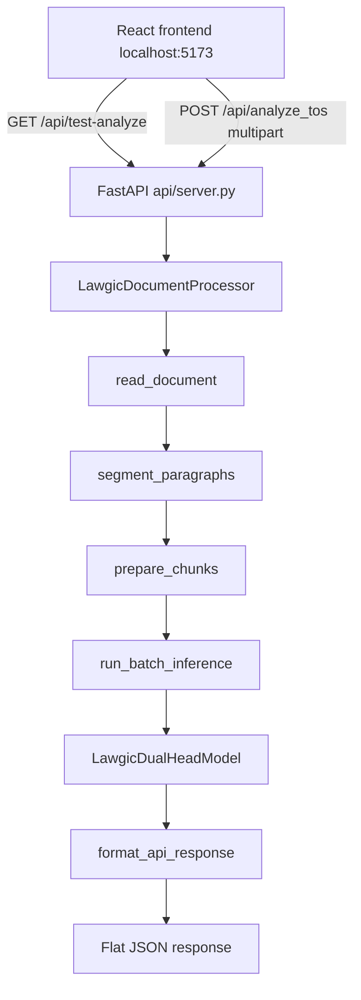

# Lawgic Inference API

This document describes the local FastAPI server that exposes the fine-tuned Legal-BERT dual-head model to the React frontend. It covers architecture, setup, running, testing, and operational notes.

---

## 1. Purpose

The Lawgic classifier was originally validated inside Jupyter notebooks (`document_inference_pipeline.ipynb`). The API bridges that notebook pipeline to a running HTTP service so the frontend can consume real model predictions without re-implementing inference in JavaScript.

**Current scope (v0):** a test endpoint that reads a hardcoded `.txt` file, plus a production upload route that accepts any `.txt` ToS via multipart form data and returns the same flat JSON response schema.

---

## 2. What Was Built

| File | Role |
|---|---|
| [`api/server.py`](../api/server.py) | Self-contained FastAPI app: model, processor, pipeline, routes |
| [`api/__init__.py`](../api/__init__.py) | Package marker so `uvicorn api.server:app` resolves correctly |

Everything lives in one server file by design. The notebook pipeline was inlined rather than extracted into a separate `lawgic/` Python package. This keeps the first integration small and mirrors the notebook logic directly.

### Components inside `api/server.py`

1. **`LawgicDualHeadModel`** — PyTorch `nn.Module` wrapping Legal-BERT with topic (44-class multi-label) and harm (3-class multi-class) heads. Identical to the class in the inference notebook.

2. **Document pipeline functions** — copied from the notebook:
   - `read_document` — UTF-8 read, line-ending normalization
   - `segment_paragraphs` — split on `\n\n`, flag short fragments as `skipped`
   - `chunk_paragraph` / `prepare_chunks` — defensive token budgeting (200-token threshold, NLTK sentence fallback)
   - `run_batch_inference` — batched forward pass with sigmoid (topics) and softmax (harm)

3. **`LawgicDocumentProcessor`** — thin wrapper exposing `analyze_tos(file_path)` that chains the pipeline steps and returns raw per-chunk inference dicts.

4. **FastAPI app** — CORS middleware, global model pre-load, and the test route.

---

## 3. Architecture



### Startup lifecycle

On import (before any route is registered):

1. NLTK `punkt_tab` data is downloaded (needed for sentence-level sub-chunking).
2. Hardware is detected: **CUDA → MPS → CPU**.
3. Tokenizer and model weights are loaded from `saved_models/lawgic_classifier_legal-bert_v3/`.
4. `LawgicDocumentProcessor` is instantiated once and held in a module-level global.

The model is **not** reloaded per request. First server start takes several seconds (weight load + NLTK). Subsequent requests only pay inference time.

### CORS

`CORSMiddleware` is registered **before** route definitions. The React Vite dev origin is explicitly whitelisted:

```
http://localhost:5173
```

Wildcards (`*`) are intentionally not used. If the frontend runs on a different port or host, add it to `allow_origins` in `api/server.py`.

---

## 4. API Reference

### `GET /api/test-analyze`

Reads the hardcoded test file, runs inference, returns JSON.

| Property | Value |
|---|---|
| Method | `GET` |
| Path | `/api/test-analyze` |
| Input | None (no body, no query params) |
| Source file | `data/new_tos/apollo_io.txt` |

#### Response schema

```json
{
  "service_name": "Apollo.io (Test Upload)",
  "is_dynamic_upload": true,
  "clauses": [
    {
      "chunk_id": 0,
      "text": "Exact chunk text from the document...",
      "predicted_topics": ["Mandatory Arbitration"],
      "harm_class": "Harmful",
      "harm_confidence": 0.9998
    }
  ]
}
```

| Field | Type | Description |
|---|---|---|
| `service_name` | `string` | Hardcoded label for the test upload. Not derived from the file. |
| `is_dynamic_upload` | `boolean` | Always `true` for this test endpoint. Signals frontend that data came from a dynamic analysis path. |
| `clauses` | `array` | One entry per inference chunk (not per skipped paragraph). |
| `clauses[].chunk_id` | `number` | Sequential chunk index across the document. |
| `clauses[].text` | `string` | Full chunk text passed to the model (not a truncated preview). |
| `clauses[].predicted_topics` | `string[]` | Topic names with sigmoid probability ≥ 0.5. May be empty. |
| `clauses[].harm_class` | `string` | `"Harmful"`, `"Neutral"`, or `"Fair"`. |
| `clauses[].harm_confidence` | `number` | Softmax probability of the predicted harm class (0–1). |

**Excluded from response:** skipped paragraphs (section headers, date stamps, fragments under 15 characters). These are preserved in the notebook DataFrame output but omitted here because they have no model predictions.

#### Error responses

| Status | Cause |
|---|---|
| `404` | `data/new_tos/apollo_io.txt` missing |
| `500` (import crash) | `saved_models/lawgic_classifier_legal-bert_v3/` missing — server fails to start |

---

### `POST /api/analyze_tos`

Analyze an uploaded `.txt` ToS file with Legal-BERT dual-head inference. This is the route the React frontend should call for real user uploads.

| Property | Value |
|---|---|
| Method | `POST` |
| Path | `/api/analyze_tos` |
| Content-Type | `multipart/form-data` |

#### Request fields

| Field | Type | Required | Description |
|---|---|---|---|
| `file` | file | yes | Plain-text `.txt` Terms of Service document |
| `service_name` | string | yes | Display name for the analyzed service (e.g. `"YouTube"`) |

#### Response schema

Same flat JSON as `GET /api/test-analyze` — `service_name` and `is_dynamic_upload` come from the request instead of hardcoded values.

```json
{
  "service_name": "YouTube",
  "is_dynamic_upload": true,
  "clauses": [
    {
      "chunk_id": 0,
      "text": "Exact chunk text from the uploaded document...",
      "predicted_topics": ["Mandatory Arbitration"],
      "harm_class": "Harmful",
      "harm_confidence": 0.9998
    }
  ]
}
```

#### Error responses

| Status | Cause |
|---|---|
| `400` | Missing/empty `service_name`, non-`.txt` file, empty upload, or whitespace-only document |
| `422` | Missing `file` or `service_name` form fields |

#### curl example

```bash
curl -X POST http://localhost:8000/api/analyze_tos \
  -F "file=@data/new_tos/apollo_io.txt" \
  -F "service_name=Apollo.io"
```

#### Frontend example

```javascript
const formData = new FormData();
formData.append("file", selectedFile);       // File object from <input type="file">
formData.append("service_name", serviceName); // user-provided label

const res = await fetch("http://localhost:8000/api/analyze_tos", {
  method: "POST",
  body: formData,
});
const data = await res.json();
```

Do **not** set `Content-Type` manually — the browser sets the multipart boundary automatically.

---

## 5. Prerequisites

### Python environment

Use the **`thesis-env`** conda environment — the same one registered as the Jupyter kernel for the inference notebook. System `uvicorn` or Homebrew Python will fail with `ModuleNotFoundError` (missing `nltk`, `torch`, etc.).

Kernel path (reference):

```
/Users/riki/anaconda3/envs/thesis-env/bin/python3
```

Dependencies are listed in [`notebooks/requirements.txt`](../notebooks/requirements.txt). Key packages: `torch`, `transformers`, `nltk`, `fastapi`, `uvicorn`.

### Model weights (local only)

Weights live at:

```
saved_models/lawgic_classifier_legal-bert_v3/
```

This directory is **gitignored**. It must be produced locally by running the finetuning notebook (`legal_bert_finetuning_dual_head.ipynb`). Required files:

- `model_state_dict.pt` (or separate `topic_head_weights.pt` + `harm_head_weights.pt`)
- `config.json`, tokenizer files
- `lawgic_topics_44.json` (topic label map)

### Test document

```
data/new_tos/apollo_io.txt
```

Committed to the repo. Apollo.io Terms of Service used as the integration test fixture.

---

## 6. How to Run

From the **repository root**:

```bash
cd "/Users/riki/Coding Projects/Thesis/lawgic"

/Users/riki/anaconda3/envs/thesis-env/bin/python3 -m uvicorn api.server:app \
  --host 0.0.0.0 \
  --port 8000 \
  --reload
```

| Flag | Why |
|---|---|
| `--host 0.0.0.0` | Accept connections from localhost and LAN (frontend, curl) |
| `--port 8000` | Avoids conflict with Vite (`5173`) and Ollama |
| `--reload` | Auto-restart on code changes during development |

If `thesis-env` is already activated:

```bash
python -m uvicorn api.server:app --host 0.0.0.0 --port 8000 --reload
```

Expected startup log:

```
INFO:     Using device: mps (Apple Silicon)
INFO:     Loading tokenizer from .../saved_models/lawgic_classifier_legal-bert_v3
INFO:     Model loaded on mps | 44 topics | 3 harm classes
INFO:     Application startup complete.
INFO:     Uvicorn running on http://0.0.0.0:8000
```

Interactive API docs (auto-generated by FastAPI):

- Swagger UI: [http://localhost:8000/docs](http://localhost:8000/docs)
- ReDoc: [http://localhost:8000/redoc](http://localhost:8000/redoc)

---

## 7. How to Test

### curl (terminal)

```bash
curl http://localhost:8000/api/test-analyze
```

Pretty-print with Python:

```bash
curl -s http://localhost:8000/api/test-analyze | python -m json.tool | head -40
```

Quick schema check:

```bash
curl -s http://localhost:8000/api/test-analyze | python -c "
import sys, json
d = json.load(sys.stdin)
assert d['service_name'] == 'Apollo.io (Test Upload)'
assert d['is_dynamic_upload'] is True
assert len(d['clauses']) > 0
c = d['clauses'][0]
assert set(c.keys()) == {'chunk_id', 'text', 'predicted_topics', 'harm_class', 'harm_confidence'}
print(f'OK — {len(d[\"clauses\"])} clauses')
"
```

### Browser / frontend

With the React app on `http://localhost:5173`, fetch:

```javascript
const res = await fetch("http://localhost:8000/api/test-analyze");
const data = await res.json();
```

CORS is pre-configured for that origin. If the browser blocks the request, confirm the API is running and the frontend origin matches `allow_origins`.

### Verified baseline (June 2026)

On a successful run against `apollo_io.txt`:

- ~75 inference chunks returned
- First chunk typically predicts `Contract Changes` with `harm_class: Neutral`
- Response time ~5 s on Apple Silicon MPS (includes full pipeline, not just model forward pass)

---

## 8. Inference Parameters

These constants in `api/server.py` must stay aligned with training conditions (see also [`lawgic_txt_ingestion.md`](lawgic_txt_ingestion.md)):

| Constant | Value | Purpose |
|---|---|---|
| `MAX_LENGTH` | 256 | Tokenizer truncation limit (matches training) |
| `TOKEN_THRESHOLD` | 200 | Sub-chunking trigger (accounts for `[CLS]`/`[SEP]` + WordPiece inflation) |
| `TOPIC_THRESHOLD` | 0.5 | Sigmoid cutoff for topic presence |
| `BATCH_SIZE` | 16 | Inference batch size |
| `MIN_CLAUSE_LENGTH` | 15 | Minimum chars for a paragraph to be analyzed |

---

## 9. Things to Remember

### Use `thesis-env`, not system Python

The most common startup failure is running plain `uvicorn` from Homebrew. Always invoke through the conda env Python or activate `thesis-env` first.

### Model weights are not in git

A fresh clone will not start the server until weights exist under `saved_models/`. Run finetuning or copy weights from a machine that has them.

### Code is duplicated from the notebook

`api/server.py` and `document_inference_pipeline.ipynb` share the same logic. If you change segmentation, chunking, or inference in the notebook, **mirror the change in the API** (or extract a shared module later).

### Apollo.txt segmentation quirk

`apollo_io.txt` uses mostly single newlines, not double newlines (`\n\n`). The pipeline splits on `\n\n`, so some logical paragraphs may be merged into larger chunks. This matches notebook behavior — not an API bug.

### Skipped paragraphs are silent in the API response

Headers like `"DEFINITIONS."` and date stamps are flagged `skipped` internally and never sent to the model. They do not appear in `clauses[]`.

### Port 8000 is intentional

Do not move to 3000 or 8080 without updating frontend fetch URLs. Port 8000 was chosen to avoid Ollama and Vite conflicts.

### Server crash on import = missing model

Unlike a 404 at request time, a missing model directory raises at import and prevents the server from starting at all. Check logs for `Model directory not found`.

### `is_dynamic_upload` and `service_name` on the test endpoint

`GET /api/test-analyze` still returns hardcoded `"Apollo.io (Test Upload)"` and `is_dynamic_upload: true`. The upload route accepts `service_name` from the client.

---

## 10. Relationship to Other Docs

| Document | Relationship |
|---|---|
| [`lawgic_txt_ingestion.md`](lawgic_txt_ingestion.md) | Full pipeline methodology (segmentation, chunking, inference) — the API implements this |
| [`lawgic_dual_head_architecture.md`](lawgic_dual_head_architecture.md) | Model architecture spec for `LawgicDualHeadModel` |
| [`data/schema/lawgic_tos_schema.md`](../data/schema/lawgic_tos_schema.md) | **Different schema** — LLM ingestion output for production ToS storage. The API test endpoint uses the simpler flat `clauses[]` schema above, not the full LLM schema. |

---

## 11. Future Work (not yet implemented)

- **Shared Python package** — extract `LawgicDocumentProcessor` and `LawgicDualHeadModel` from notebook + API into `lawgic/` to eliminate duplication
- **Health check endpoint** — `GET /health` returning model load status and device
- **Configurable CORS** — environment variable for allowed origins in production
- **Alignment with full `lawgic_tos_schema.md`** — if the frontend needs `notable_clauses`, `analysis`, etc.

---

## 12. Quick Troubleshooting

| Symptom | Fix |
|---|---|
| `ModuleNotFoundError: nltk` | Use `thesis-env` Python, not system Python |
| `Model directory not found` | Run finetuning notebook or copy `saved_models/` locally |
| Browser CORS error | Confirm API runs on `:8000`, frontend on `:5173`, check `allow_origins` |
| `404` on `/api/test-analyze` | Confirm `data/new_tos/apollo_io.txt` exists |
| Very slow first request | Normal — model already loaded; inference on long docs takes seconds |
| Empty `predicted_topics` on many chunks | Lower `TOPIC_THRESHOLD` in `api/server.py` (default 0.5) |
